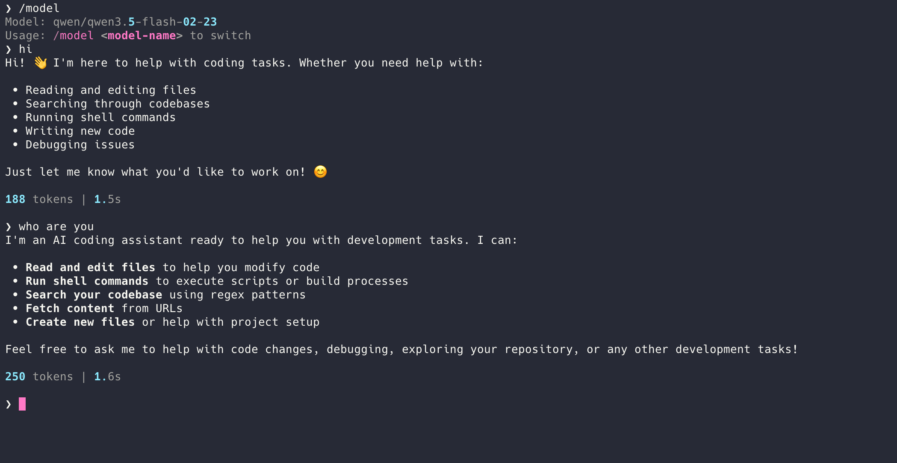

<p align="center">
  <h1 align="center">nanocc</h1>
  <p align="center">
    <b>Python Nano Claude Code</b> — 基于 <a href="https://docs.anthropic.com/en/docs/claude-code">Claude Code</a> 的 Python 精简复刻（~10,000 行）
  </p>
  <p align="center">
    CLI 日常使用 &nbsp;|&nbsp; Agent SDK 构建代理 &nbsp;|&nbsp; IM 通道对接
  </p>
  <p align="center">
    <a href="https://github.com/ZJUFangzh/nanocc/stargazers"></a>
    &nbsp;
    <a href="https://github.com/ZJUFangzh/nanocc/blob/main/LICENSE"></a>
    &nbsp;
    
    &nbsp;
    
    &nbsp;
    
  </p>
  <p align="center">
    <a href="README.md">English</a>
  </p>
</p>

<p align="center">
  
</p>

---

## News

- **2026-04-03** — Session 持久化：增量 transcript append、compact boundary 感知恢复、`-c`/`--continue` 标志、`/resume` 命令、AgentTool 超时、工具并发异常处理。176 个测试。
- **2026-04-03** — Phase 7 全部完成 + 链路修复：9 项跨模块集成修复，153 个测试全部通过。Hooks、Assistant/KAIROS 模式、子 Agent、MCP 全链路打通。
- **2026-04-03** — Provider 配置重构：`settings.json` 持久化配置、REPL 内 `/model` 热切换、AgentTool 修复。
- **2026-04-02** — 首次发布：一天内完成 Phase 1-7。核心 agent loop、12 个工具、三层压缩、记忆系统、hooks、skills、MCP、子 agent、assistant 模式全部就位。

---

## 特性

- **Agent Loop** — 异步 generator 状态机，忠实复刻 Claude Code 的 `query()` 模式
- **12 个内置工具** — Bash、Read、Write、Edit、Glob、Grep、Agent、AskUser、WebFetch、Skill、Brief、Sleep
- **多 Provider 支持** — OpenRouter（默认）、Anthropic、OpenAI、Together、Groq，或任意 OpenAI 兼容 API
- **三层上下文压缩** — 预算截断 → 微压缩 → LLM 摘要自动压缩
- **记忆系统** — 持久记忆（4 种类型）、会话记忆（10 个固定 section）、auto-dream 自动归纳
- **Hook 系统** — 5 种事件 × 3 种 hook 类型，工具执行前后自动触发
- **Skill 插件** — 文件即插件，支持 fork 隔离执行
- **MCP 集成** — stdio / HTTP / SSE 三种传输协议，工具 + 资源
- **会话持久化** — 增量 transcript 保存、compact boundary 感知恢复、`-c` 续接、`/resume` 选择器
- **子 Agent** — fork 隔离上下文 + coordinator 并行/串行任务协调
- **Assistant / KAIROS 模式** — 长驻守护，周期性 tick 唤醒，结构化 Brief 输出

## 快速开始

### 安装

```bash
# 需要 Python >=3.11 和 uv
uv sync
```

### 配置

创建 `~/.nanocc/settings.json`：

```json
{
  "provider": "openrouter",
  "model": "qwen/qwen3.5-flash-02-23",
  "apiKey": "sk-or-v1-..."
}
```

自定义 OpenAI 兼容 API：

```json
{
  "provider": "custom",
  "apiBaseUrl": "https://my-api.com/v1",
  "model": "my-model",
  "apiKey": "..."
}
```

### 运行

```bash
# 单轮对话
uv run nanocc -p "解释这个代码库"

# 交互式 REPL
uv run nanocc

# 恢复上次会话
uv run nanocc -c

# CLI 标志覆盖
uv run nanocc -m anthropic/claude-sonnet-4 --api-key $KEY

# REPL 中切换模型 / 恢复会话
> /model qwen/qwen3.5-flash-02-23
> /resume
```

### 全局安装（可选）

```bash
uv tool install -e .    # 安装到 ~/.local/bin/nanocc
# 之后在任意目录直接运行 nanocc
```

## Provider 配置

| Provider | 环境变量 | 模型格式 | 说明 |
|---|---|---|---|
| `openrouter`（默认）| `OPENROUTER_API_KEY` | `provider/model` | 模型覆盖最广 |
| `anthropic` | `ANTHROPIC_API_KEY` | `claude-sonnet-4-20250514` | 原生 SDK |
| `openai` | `OPENAI_API_KEY` | `gpt-4o` | |
| `custom` | — | 任意 | 需配 `apiBaseUrl` |

优先级：`/model` 会话覆盖 > CLI 标志 > 环境变量 > `settings.json` > 内置默认值

## 架构

### 全局概览

```
┌─────────────────────────────────────────────────────────┐
│                      入口层                              │
│    CLI (click+rich)  │  Channel (IM)  │  SDK (编程接口)   │
└─────────┬───────────┴───────┬────────┴──────┬───────────┘
          │                   │               │
          ▼                   ▼               ▼
┌─────────────────────────────────────────────────────────┐
│              QueryEngine (engine.py)                     │
│  有状态会话容器：messages、usage、abort、                  │
│  记忆抽取、会话持久化（--continue 恢复）                   │
└─────────────────────────┬───────────────────────────────┘
                          │
                          ▼
┌─────────────────────────────────────────────────────────┐
│              query() (query.py)                          │
│  异步 generator 状态机 — 核心 agent loop                  │
│                                                          │
│  ┌─ 每轮迭代 ───────────────────────────────────────┐   │
│  │ 1. 上下文管线：budget → micro → auto compact      │   │
│  │ 2. LLM 流式：provider.stream() → ProviderEvent   │   │
│  │ 3. Abort 检查 + synthetic tool_result 补齐        │   │
│  │ 4. 工具执行（读并行 / 写串行）                     │   │
│  │    ├─ hook: tool_start                            │   │
│  │    ├─ 执行工具                                    │   │
│  │    └─ hook: tool_complete                         │   │
│  │ 5. End turn → hook: stop → Terminal               │   │
│  └──────────────────────────────────────────────────┘   │
└────────┬──────────────────┬─────────────────────────────┘
         │                  │
         ▼                  ▼
┌────────────────┐  ┌────────────────────────────────────┐
│  LLM Providers │  │  工具编排                           │
│                │  │                                     │
│  ProviderEvent │  │  partition_tool_calls():             │
│  归一化层      │  │    read_only=True  → 并行（≤10）    │
│                │  │    read_only=False → 串行            │
│  • anthropic   │  │                                     │
│  • openai_compat│  │  12 个内置工具 + MCP 工具           │
│  • custom      │  │                                     │
└────────────────┘  └────────────────────────────────────┘
```

### 核心 Agent Loop (`query.py`)

nanocc 的心脏 — 忠实复刻 Claude Code 的异步 generator 状态机。**不是** ReAct 循环。

```python
async def query(params: QueryParams) -> AsyncGenerator[StreamEvent | Message, Terminal]:
    state = LoopState(messages, tool_use_context, turn_count=0, ...)
    while True:
        # 1. 上下文治理管线
        apply_tool_result_budget(state.messages)     # >30K 结果截断
        micro_compact(state.messages)                 # 清理旧 tool_results
        await auto_compact_if_needed(state.messages)  # 超阈值 LLM 摘要

        # 2. 流式调用 LLM
        async for event in provider.stream(messages, system_prompt, tools):
            yield event  # text_delta, tool_use, usage, ...

        # 3. 工具执行 + hook 触发
        if tool_use_blocks:
            await hook_engine.fire("tool_start", block)
            result = await run_tool(block, context)
            await hook_engine.fire("tool_complete", block, result)
            continue  # 下一轮迭代

        # 4. 无工具调用 → 结束
        await hook_engine.fire("stop", messages)
        return Terminal(reason="completed")
```

终止状态：`completed`、`aborted_streaming`、`aborted_tools`、`prompt_too_long`、`max_turns`、`model_error`

### LLM Provider 抽象

所有 Provider 实现相同协议 — agent loop 只看到归一化的 `ProviderEvent`，不接触任何 SDK 特定类型：

```python
class LLMProvider(Protocol):
    async def stream(messages, system_prompt, tools, *, model, ...) -> AsyncGenerator[ProviderEvent]
    def count_tokens(messages, model) -> int
    def get_context_window(model) -> int
```

新增 Provider = 实现 3 个方法（约 300 行）。

### 工具系统

```python
class Tool(Protocol):
    name: str
    input_schema: dict       # JSON Schema
    is_read_only: bool       # True → 可并行

    def check_permissions(input, context) -> allow | deny | ask
    async def execute(input, context) -> ToolResult
```

并发模型（复刻 Claude Code）：
- `is_read_only=True` 工具**并行**执行（最多 10 个并发）
- 写工具**串行**执行，逐个运行

### 三层上下文压缩

Claude Code 7 层 → nanocc 3 层，效果一致：

```
Layer 1: tool_result_budget    ─── 单结果 >30K 字符 → 截断 + 落盘
                ↓
Layer 2: micro_compact         ─── 旧 tool_results → [cleared]，保留最近 5 个
                ↓
Layer 3: auto_compact          ─── 超阈值 → LLM 摘要压缩整段对话
                ↓
        post_compact           ─── 重注入最近 5 个文件 + 活跃 plan + 已加载 skill
```

关键阈值（与 Claude Code 一致）：autocompact 缓冲 13K tokens，摘要预留 20K tokens，post-compact 文件恢复最多 5 文件 / 50K tokens，连续失败 3 次熔断。

### 记忆系统

```
┌─────────────────────────────────────────────────────────┐
│ 长期记忆 (memdir.py)                                     │
│ MEMORY.md 索引（≤200 行）+ 单独 topic 文件                │
│ 4 种类型：user | feedback | project | reference          │
│ 检索：扫描 frontmatter → LLM 排序取 top 5 → 注入上下文   │
├─────────────────────────────────────────────────────────┤
│ 会话记忆 (session_memory.py)                              │
│ 结构化工作笔记 — 10 个固定 section：                       │
│ Current State, Task, Files Modified, Errors, Worklog,    │
│ Open Questions, Dependencies, Decisions Made, ...        │
│ 触发：10K token 初始化，5K 增量，3+ 工具调用               │
├─────────────────────────────────────────────────────────┤
│ 记忆抽取 (extract.py)                                    │
│ 每轮结束后后台 fire-and-forget：                          │
│ fork 子 agent → 分析对话 → 写入 memory 文件               │
├─────────────────────────────────────────────────────────┤
│ Auto Dream (auto_dream.py)                               │
│ 离线记忆蒸馏（24h + 5 sessions 门控）：                    │
│ Phase 1: Orient — 读取现有 memory 结构                    │
│ Phase 2: Scan — 从 session transcript 中扫描信号           │
│ Phase 3: Consolidate — LLM 合并、去重、日期绝对化          │
└─────────────────────────────────────────────────────────┘
```

### Hook 系统

声明式 hooks 在工具执行边界自动触发 — 基础设施层面的保证，不是"建议 AI 去做"：

| 事件 | 触发时机 | 典型用途 |
|---|---|---|
| `tool_start` | 工具执行前 | 输入验证、审计日志 |
| `tool_complete` | 工具执行后 | 自动 lint、测试运行 |
| `tool_error` | 工具出错时 | 错误上报 |
| `stop` | Agent 完成回合 | 安全审查、通知 |
| `subagent_stop` | 子 Agent 完成 | 结果聚合 |

3 种 hook 类型：`command`（shell）、`prompt`（LLM）、`http`（webhook）。支持 `if` 条件匹配、`once` 一次性自动移除、session 级注册。

### 子 Agent

- **Fork** (`agents/fork.py`) — 创建隔离 agent，独立 message 历史但共享 provider。用于并行研究、skill fork 模式、记忆抽取。
- **Coordinator** (`agents/coordinator.py`) — 向多个 fork agent 分发任务。并行模式处理只读任务，串行模式处理顺序写操作。
- **AgentTool** — 作为工具暴露给 LLM，模型可按需派生子 agent。

### MCP 集成

轻量 MCP 客户端，支持 3 种传输协议：

| 传输协议 | 使用场景 |
|---|---|
| `stdio` | 本地进程（如文件系统、数据库工具）|
| `http` | 远程 HTTP 服务 |
| `sse` | Server-Sent Events 流 |

MCP 工具被包装为原生 `Tool` 对象（`mcp__{server}__{tool}`），参与统一的编排管线。资源通过 `list_resources` / `read_resource` 访问。

### Harness Engineering 设计理念

nanocc 遵循「**Harness Engineering**」理念：不依赖 prompt engineering 控制 AI 怎么想，而是**设计 AI 工作的环境和反馈机制**，让正确行为成为系统属性。

> **Prompt engineering** 像给新员工做入职培训——你教得再好，他也会忘。
> **Harness engineering** 像设计办公环境和工作流程：编码规范贴在工位旁（CLAUDE.md 注入），每次提交自动跑 CI（hooks），犯过的错记在 wiki 里新人也能看到（feedback memory），每周 review 清理过期决策（auto dream）。

| 模块 | Harness 机制 | 解决的问题 |
|---|---|---|
| `memory/claude_md.py` | CLAUDE.md 层级注入 | 风格漂移 |
| `memory/memdir.py` | 4 类 memory + 排除规则 | 认知污染 |
| `memory/session_memory.py` | 固定 10-section 模板 | compact 后状态丢失 |
| `memory/extract.py` | 自动 feedback 抽取 | 同样错误反复犯 |
| `memory/auto_dream.py` | 门控蒸馏 + 去重 | 记忆随时间腐烂 |
| `compact/post_compact.py` | 精确文件重注入 | compact 后上下文断裂 |
| `hooks/engine.py` | 工具执行自动触发 | 质量漂移 |
| `context.py` | 三段式 system prompt + 缓存 | 指令遗忘 |

## 目录结构

```
src/nanocc/
├── types.py              # 核心类型（Message, ContentBlock, QueryParams, LoopState）
├── constants.py          # 常量阈值（与 Claude Code 一致）
├── messages.py           # 消息创建 / API 格式转换
├── query.py              # agent loop 异步 generator 状态机
├── context.py            # 三段式 system prompt 装配 + cache_control
├── engine.py             # 有状态会话容器（get_state/restore_state）
├── providers/            # LLM 后端（anthropic / openai_compat）
├── tools/                # 12 个工具 + 编排（含 hook 集成）
├── compact/              # 上下文管理（budget → micro → auto compact）
├── memory/               # 记忆系统（memdir、session、auto_dream、daily_log）
├── hooks/                # Hook 系统（5 事件 × 3 类型）
├── skills/               # Skill 加载与执行（含 fork 模式）
├── mcp/                  # MCP server 集成（stdio/http/sse + 资源）
├── agents/               # 子 Agent（fork + coordinator）
├── assistant/            # Assistant/KAIROS 模式（proactive tick、Brief/Sleep）
├── cli/                  # CLI 入口（click + rich）
└── utils/                # 工具模块（abort、tokens、git、config、cost）

tests/                    # 176 个测试，mock provider，无需 API key
```

## 开发

```bash
# 运行全量测试（无需 API key）
uv run pytest tests/ -v

# 单模块测试
uv run pytest tests/test_query.py -v

# 验证导入
uv run python -c "import nanocc"
```

## 当前状态

| 指标 | 值 |
|---|---|
| 源码行数 | ~8,100 |
| 目标行数 | ~10,000 |
| 已完成 Phase | 7 / 10 + 链路修复 |
| 内置工具 | 12 |
| Provider | 3 + custom |
| Compact 层数 | 3 |
| 记忆模块 | 6 |
| MCP 传输协议 | 3 |
| 测试用例 | 176 |

详细的阶段进度见 [docs/progress.md](docs/progress.md)，完整架构规划见 [structure.md](structure.md)。

## 路线图

| Phase | 内容 | 预估行数 |
|---|---|---|
| 8 | CLI 终端 UI 完善 | ~1,000 |
| 9 | Channel / IM 通道（Telegram 等）| ~700 |
| 10 | SDK 公开 API + OpenAI Provider + 打包 | ~600 |

## 技术栈

- **Python >=3.11**，用 [uv](https://github.com/astral-sh/uv) 管理依赖
- **构建**: hatchling
- **CLI**: click + rich
- **LLM**: anthropic SDK（原生）+ openai SDK（兼容层）
- **类型系统**: dataclass（不用 Pydantic）

## Star History

<a href="https://star-history.com/#ZJUFangzh/nanocc&Date">
 <picture>
   <source media="(prefers-color-scheme: dark)" srcset="https://api.star-history.com/svg?repos=ZJUFangzh/nanocc&type=Date&theme=dark" />
   <source media="(prefers-color-scheme: light)" srcset="https://api.star-history.com/svg?repos=ZJUFangzh/nanocc&type=Date" />
   
 </picture>
</a>

## 许可证

MIT
